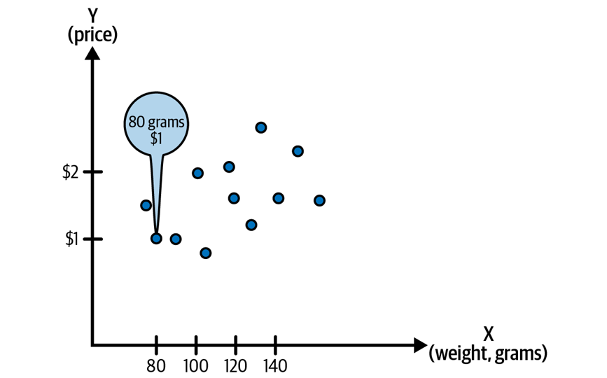
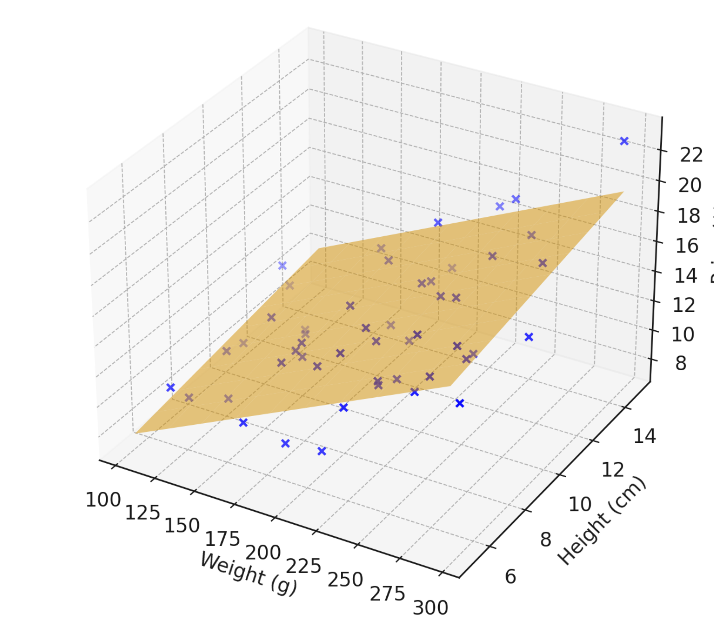
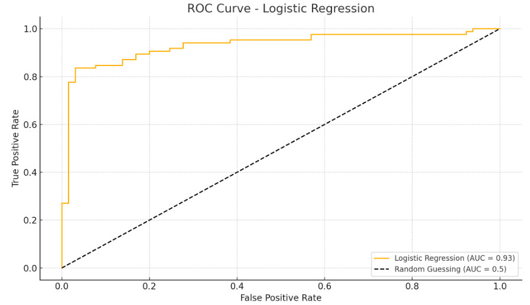

# Machine Learning Basic Concepts <!-- omit in toc -->

*Published on 2025-03-12 in [AI](../topics/ai.html)*
- [Statistical and Foundational Techniques](#statistical-and-foundational-techniques)
  - [Independent and Dependent Variables](#independent-and-dependent-variables)
  - [Linear Regression](#linear-regression)
  - [Logistic Regression](#logistic-regression)
  - [Training and Testing Set](#training-and-testing-set)
  - [Underfitting and Overfitting](#underfitting-and-overfitting)
  - [Regularization](#regularization)
  - [Imbalanced Dataset](#imbalanced-dataset)
- [Supervised, Unsupervised, and Reinforecement Learning](#supervised-unsupervised-and-reinforecement-learning)
  - [Labeled Data](#labeled-data)
  - [Supervised Learning](#supervised-learning)
  - [Unsupervised Learning](#unsupervised-learning)
  - [Semisupervised Learning](#semisupervised-learning)
  - [Self-Supervised Learning](#self-supervised-learning)
  - [Reinforcement Learning](#reinforcement-learning)
- [NLP](#nlp)
  - [NLP Concepts](#nlp-concepts)
  - [LSTM](#lstm)
  - [Transformer](#transformer)
  - [BERT](#bert)
- [LLM](#llm)
  - [Data cleaning process for training Data](#data-cleaning-process-for-training-data)
  - [KV caching](#kv-caching)
  - [Model Quantization](#model-quantization)
  - [Finetuning](#finetuning)
    - [LoRA](#lora)
  - [Engineering](#engineering)
- [Recommender System Algorithms](#recommender-system-algorithms)
  - [CF](#cf)
  - [Explicit and Implicit Ratings](#explicit-and-implicit-ratings)
  - [Content-Based Recommender Systems](#content-based-recommender-systems)
  - [User-Based/Item-Based vs. Content-Based Recommender Systems](#user-baseditem-based-vs-content-based-recommender-systems)
  - [Matrix Factorization](#matrix-factorization)
- [Vision Algorithms](#vision-algorithms)
  - [CNN](#cnn)
  - [Transfer Learning](#transfer-learning)
  - [Generative Adversarial Networks](#generative-adversarial-networks)
  - [Additional Computer Vision Use Cases](#additional-computer-vision-use-cases)

# Statistical and Foundational Techniques

Fundamental statistical techniques you need to know and be able to explain

## Independent and Dependent Variables

In data science, **variables** usually refer to the features or data points used to train a model. **Independent variables** usually 
refer to the features or the inputs to the model. And the **dependent variables** refer to target outcome of the model. 

Let’s say we want to predict the price of an apple, and we have a dataset that includes weight, height, color, and price.

The independent variables (also called features) are things like weight, height, and color. And the dependent variable is the price, because the price depends on the apple conditions like height and weight.

For example, heavier or larger apples might be priced higher than smaller ones, so weight and height can help predict the price.

## Linear Regression

Linear regression is a basic **statistical method** used to model the relationship between one dependent variable and one or more (Multiple linear regression) independent variables. It tries to fit a straight line through the data that best predicts the output. 

**Linear Regression Function**

$$
\hat{y} = w x + b
$$

Where:

* $x$ is the input feature
* $w$ is the weight (slope)
* $b$ is the bias (intercept)
* $\hat{y}$ is the predicted output

Let's use previous example, if we are predicting apple prices based on weight, linear regression will find the line that best shows how price (y-axis) changes as weight (x-axis) changes.

When it comes to multiple variables and want to fit it by Linear regression. We will have two or more independent variables, the regression becomes to 3D or higher dimensions and show how the different variable affecting the apple price. 

**Multiple Linear Regression**

$$
\hat{y} = \sum_{i=1}^{n} w_i x_i + b
$$

Where:

* $x_1, x_2, \ldots, x_n$ are the input features
* $w_1, w_2, \ldots, w_n$ are the corresponding weights
* $b$ is the bias
* $\hat{y}$ is the predicted output

During the linear regression training process, we start with a random line and adjust it based on the sum of squared residuals (SSR). With each iteration, the SSR gets smaller and smaller until it stops at certain point, meaning we have found the best approximation the regression model can make.

## Logistic Regression

**Logistic regression** is used when we are sovling binary classification problem. Instead of fitting a straight line like Linear Regression, it fits an S-shaped curve (sigmoid function) that gives a probability between 0 and 1.

**Sigmoid Function**

$$
\sigma(z) = \frac{1}{1 + e^{-z}}
$$

Where:

* $z = w \cdot x + b$ in logistic regression
* $\sigma(z)$ gives a probability between 0 and 1

One of the important concept of Logistic regression is the evaluation metric, which called Area Under the ROC (Receiver Operating Characteristic) Curve (AUC)

The yellow line shows the model's performance, and the higher the curve above the dashed line means the better the model is classifying. 

## Training and Testing Set

For the apple dataset, if we want to check how well the model predicts prices for new apples, we first need to evaluate our model before it go live. That means splitting the data into a training set and a testing set. We only use the training set to train the model, while the testing set stays completely separate. This helps make sure the model isn’t *"cheating"* by just memorizing the answers. So we can break out 80% of the apple data to use for model training and then save 20% of the apple data for testing purpose. 

**Question:** How are we goning to evalute the model during training process?

We can have validation set, the validation set allows use to monitor the model's performance during the traininig process without *"formally"* evaluating it. So most of the time we sperate the data into three buckets, 80% of the data for training, 10% of the data for validating the model during training, and the rest of the data save for testing the model after training.

## Underfitting and Overfitting

The model is not perform well on real world dataset is very common. There could be many reasons behind it, such as the data might require some data cleaning and data analysis before training.

**Underfitting** happens when the model doesn't capture the patterns or relationships between the independent variables. In other words, it’s too simple and doesn’t fit the dataset well.

**Overfitting** happens when the model fits the training data too well. It performs great on the training set, but when tested on new data, like test set, the accuracy drops. 

## Regularization

Regularization is a technique used to reduce overfitting of ML models. Generally, regularization will create a damper on model weights/coefficient and won't let the model fit too deep on during the training process.

But there always have trade-off. When trying to improve ML model, we always trying to fix bias and variance. **Bias** refers to the overall inaccuracy of the model and can often be caused by the model too simple. **Variance** comes from the overfitting, when the model fits the training set too well. Regularization might cause a model to redus its variance (solve overfit problem) but might increase bias at the same time. So, we can’t just blindly set regularization to a high value. If it’s too strong, it can limit the model too much and cause underfitting. Regularization helps prevent overfitting, but it needs to be balanced.

**Common Regularization**

L1 regularization, also known as lasso regularization, is a type of regularization that <u>shrinks model parameters toward zero.</u> 

L2 regularization (also known as ridge regularization) <u> adds a penalty term to the objective function (optimization)</u> that is proportional to the square of the coefficients of the model. This penalty term shrinks the coefficients toward zero, but unlike L1 (lasso) regularization, it does not make any of the coefficients exactly equal to zero.

L2 regularization can help reduce overfitting and improve the stability of the model by keeping coefficients from becoming too large. Both L1 and L2 regularization are commonly used to prevent overfitting and improve the generalization of ML models.

## Imbalanced Dataset

Imbalanced dataset in ML refer to datasets in which some classes or categories outweigh others. There are several way to deal with imbalanced dataset.

**Data Augmentation**

Data Augmentation is to generate more examples for the ML model to train on. Such as rotating/flipping images. That can genreate more and more data and also a way to prevent overfitting.

**Oversampling**

Oversampling (in class balancing) often involves randomly duplicating samples from the minority class to balance the dataset. 

**Undersampling**

Undersampling means you remove some data from the majority class (e.g., take out some fresh apple data) so both classes are closer in size.

**Ensemble methods**

Ensemble methods can also be used to increase model performance when dealing with an imbalanced dataset.11 Each model in the ensemble can be trained on a different subset of the data and can help learn the nuances of each class better.

# Supervised, Unsupervised, and Reinforecement Learning

## Labeled Data

## Supervised Learning

## Unsupervised Learning

## Semisupervised Learning

## Self-Supervised Learning

## Reinforcement Learning

# NLP
## NLP Concepts
## LSTM
## Transformer
## BERT

# LLM

## Data cleaning process for training Data

## KV caching
How kv caching save memory and computation?

How batching save computation?

Dynamic batching

Static batching

## Model Quantization

## Finetuning
### LoRA

What is RoPE?

FFN?

DPO/PPO/RLHF

## Engineering

OOM issue

API rate limit

OOV problem during RAG system

Chunking problem in RAG system

# Recommender System Algorithms
## CF
## Explicit and Implicit Ratings
## Content-Based Recommender Systems
## User-Based/Item-Based vs. Content-Based Recommender Systems
## Matrix Factorization

# Vision Algorithms
## CNN
## Transfer Learning
## Generative Adversarial Networks
## Additional Computer Vision Use Cases