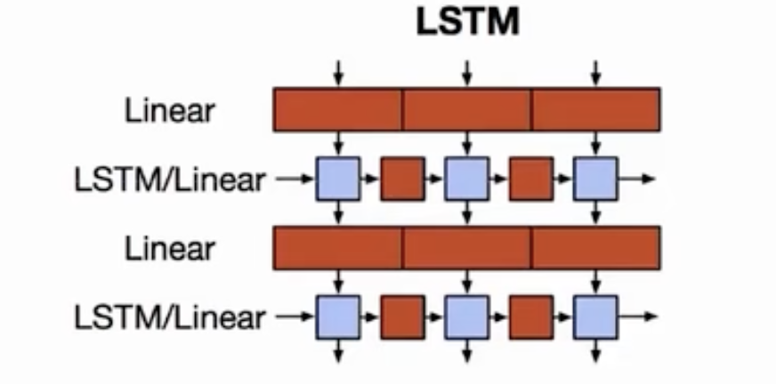
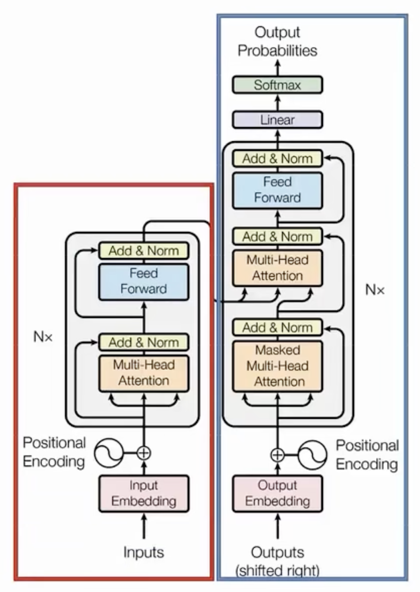
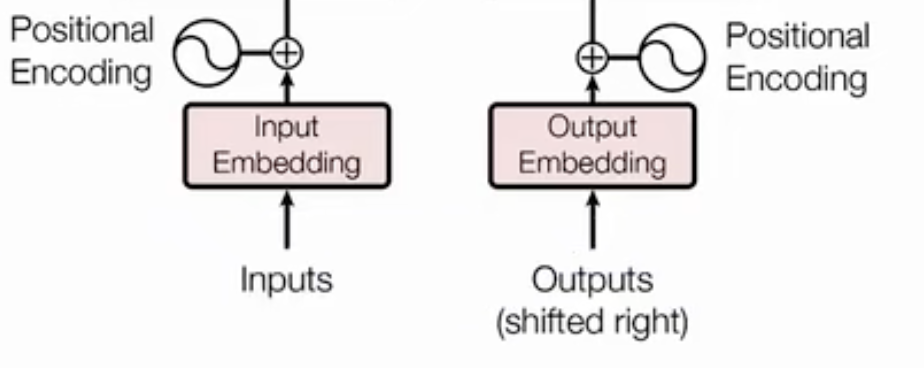

# Transformer Explainations

*Published on 2025-01-05 in [AI](../topics/ai.html)*

- [Overview](#overview)
- [Encoding](#encoding)
- [Transformer Block Encoder](#transformer-block-encoder)

## Overview

Before explaining what a transformer is, let's review RNNs first.RNNs can perform well in many tasks, especially with three-dimensional datasets, but their limitations are also very apparent.

The Figure 1 shows a simple two-layer LSTM. We can easily observe a disadvantage of RNNs: the network must execute sequentially. In an NLP task, it first needs to calculate (Purple Box) and get a representation of the first position (Red Box), then calculate the representation of the second position, and so on.

In this case, the neural network cannot fully use the GPU for parallel computing, which is inefficient and results in wasted resources. Although RNNs have many variants, such as GRUs and LSTMs, they still require attention mechanisms to address issues like information bottlenecks.

Can we completely abandon RNNs for NLP tasks?

The answer is obviously YES!!! Google researchers published "Attention Is All You Need" in 2017. The title itself answers this question.

Well, let's first take a closer look at the transformer strucuter. We can see that it is also an encoder and decoder structure. The encoder is outlined in red, and the decor is represented in blue.

The first layer is input layer. In NLP task, the input most likely as a text, the first layer is going to devide the input text to many small unit(called token).

There are two key differences compared to RNNs. First, the transformer uses BPE (Byte Pair Encoding) to divide the input text. Second, the transformer incorporates the position of tokens in the sequence, a feature known as positional encoding.

Next is a main component of the transformer, which is a stack of several encoder/decoder blocks. 

It is worth noting that the blocks in different layers of the encoder/decoder blocks have exactly the same structure, and with the only difference being their parameters.  This is how the transformer achieves a deeper and more expressive model through this stacking approach in NLP.

The final layer is simply a linear output layer followed by a softmax function to produce a probability distribution. During training, it still uses cross-entropy loss\\[H(p, q) = - \sum_{i=1}^{N} p(i) \log q(i)\\] to update the model's weights.

This is the overview of the Transformer structure.

## Input Encoding

### Byte Pair Encoding (BPE)

There are many ways to split a sentence into tokens. The easiest and most common way is to separate it by spaces and use Word2Vec to get the embeddings. However, there are some issues with this approach. For example, the dictionary can become very large, or the plural form of a word and its root form may correspond to two completely different embeddings.

BPE can avoid these issues and is also the encoding algorithm used in transformers The algorithm is very simple.

First, perform a Bag-of-Words (BoW) to calculate the frequency of each word. And then, apply it at the character level to break words into even smaller pieces. Eventually, this process will reach the maximum vocabulary size as needed based on the documents.

| Frq | Word |
|-------|-------------|
| 5     | low         |
| 2     | lower       |
| 6     | new**es**t      |
| 3     | wild**es**t     |

Suppose we have an article where 'low' appears 5 times, 'lower' appears 2 times, 'newest' appears 6 times, and 'wildest' appears 3 times as the initial BoW.

Inital vocabulary: l, o, w, e, r, n, s, t, i, d

Next, we need to find the most frequent pair. From the table, we can see that (e, s) is the most frequent pair. In this document, 'es' appears 9 times (6+3), so we can add 'es' as a pair to our vocabulary. Additionally, we can remove 's' since it no longer appears on its own.

Updated vocabulary: l, o, w, e, r, n, <s>s</s>, t, i, d, **es**

Now the vocabulary is updated, we can repeat the same step. This time, we see that 'est' appears very frequently, so we can update our vocabulary again. Since 'est' is covered 'es', so we can remove 'es' from the vocabulary as well.

Updated vocabulary: l, o, w, e, r, n, <s>s</s>, t, i, d, <s>es</s>, **est**

Finally, we will reach the desired number of tokens and stop the process.

BPE is mainly designed to address the OOV(Out of vocabulary) problem. OOV refers to a word that does not appear in the vocabulary, meaning it is unrecognized and marked as **\<unk\>** while getting the word representative.

In the previous example, when a new word appears, such as 'lowest', which is an OOV in our case, we can segment it into 'low' and 'est' to obtain a representation instead of <unk>. Furthermore, the relationship between 'low' and 'lowest' can be generalized to 'smart' and 'smartest', and so on.

### Positional Encoding (PE)

Transformer is unlike RNN, transformer cannot rely on the order of words to establish relationships between positions. In NLP tasks, we observe that word position in a sentence is crucial as it determines the sentence's meaning. Without PE, the transformer cannot differentiate the same words in different positions. This is why we need PE to help the transformer understand the position.

Once positional encoding is added so that the same words at different locations have different representations, the positional encoding (PE) is defined as:

\\[
PE_{(pos, 2i)} = \sin\left(\frac{pos}{10000^{\frac{2i}{d}}}\right)
\\]

\\[
PE_{(pos, 2i+1)} = \cos\left(\frac{pos}{10000^{\frac{2i}{d}}}\right)
\\]

\( pos \) is the postition of the a toekn [0 - n]
\( d \) is the dimension of BPE
\( i \) is the index of embedding, ranges from 0 to d/2

The trigonometric functions are used here to ensure that the calculated encoding values won't be ridiculous, neither too large nor too small. If a token is in an even position, sine is used; if it is in an odd position, cosine is used. In that case, it can distingush the same word in different postion.

When we have the PE value, the input embedding is completed and discribe as 
\\[
Input Embedding = BPE + PE
\\]

## Transformer Block Encoder

The encoder mainly consists of two parts: multi-head attention and a feed-forward network, which after receiving the input embedding.

### Multi-Head Attention

#### Attention Layer

In transformer, the input to the attention layer consists of a query (q) and a set of key-value (k, v) pairs. The queries and keys are vectors with a dimension of $d_k$ and values are vetors with dimension $d_v$

**Query(q):** the query is derived from the input token embeddings (or hidden representations) by multiplying them with a learned weight matrix $W^Q$

**Key(k):** Each input token generates a key vector by being multiplied with another learned weight matrix $W^K$

**Value(v):** Values are also derived by multiplying the input embeddings with a learned weight matrix $W^V$.

The output is a N attention score, which calculated as  weighted sum of the values, where the weight of each value is computed as the dot product of the query and the corresponding key.

\\[A(q, K, V) = \sum_{i} \frac{e^{q \cdot k_i}}{\sum_{j} e^{q \cdot k_j}} v_i\\]

If we have many queries, we can combine them into a single large query matrix (Q) and apply the same process for each query (q). The formula can be expressed as:

\\[A(Q, K, V) = softmax(QK^T)V\\]

### Feed-Forward Network (2 layer MLP)

### Tricks 

**Residual Connection:** Inspired by ResNet, it allows the direct addition of the input and output, which helps mitigate the problem of vanishing gradients when the model becomes too deep.

**Layer Normalization:** Transforms the vector into a distribution with a mean of 0 and a variance of 1. This technique addresses the issues of vanishing gradients and exploding gradients.

